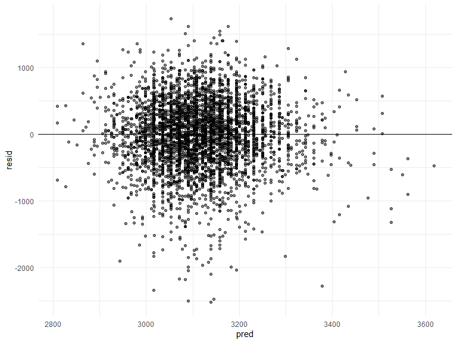

HW 6
================

# Problem 2

*Description of raw data* This dataset overviews demographic and
geographic data for homicide victims across various cities in the United
States. It has `n rows(homicide_rawdf)` rows and `ncols(homicide_rawdf)`
columns.

Steps:

1.  Cleaned the data

2.  Use the glm function for Baltimore

# Problem 3

prediction vs residuals (diff between actual and predicted); there
should be no linearity because it would be a violation of the assumption

you use the model to get the predicted model to get the residual show
rmse

Steps:

1.  Cleaned the data

``` r
birth_cleandf = 
  birth_rawdf %>% 
  mutate(
    babysex = as.factor(babysex),
    frace = as.factor(frace),
    malform = as.factor(frace),
    mrace = as.factor(mrace)
  ) %>% 
  drop_na()
```

residual plots have a line going through 0

geom_point (hline)

2.  I propose the following model:

y = b(babysex) + b(smoken) + b(wtgain) + error

``` r
fit_mymodel = lm(bwt ~ babysex + smoken + momage, data = birth_cleandf)
```

``` r
fit_no1 = lm(bwt ~ blength + gaweeks, data = birth_cleandf) %>% 
  broom::tidy()

fit_no2 = lm(bwt ~ bhead + blength + babysex + bhead*blength + bhead*babysex + blength*babysex, data = birth_cleandf) %>% 
  broom::tidy()
```

Plot residuals vs predictors

``` r
birth_reduced = 
  birth_cleandf %>% 
  select()
```

``` r
birth_cleandf %>%
  add_predictions(fit_mymodel) %>% 
  add_residuals(fit_mymodel) %>% 
  ggplot(aes(x = pred, y = resid)) + geom_point(alpha = 0.5) + geom_hline(yintercept = 0)
```



*Identify RMSE*
