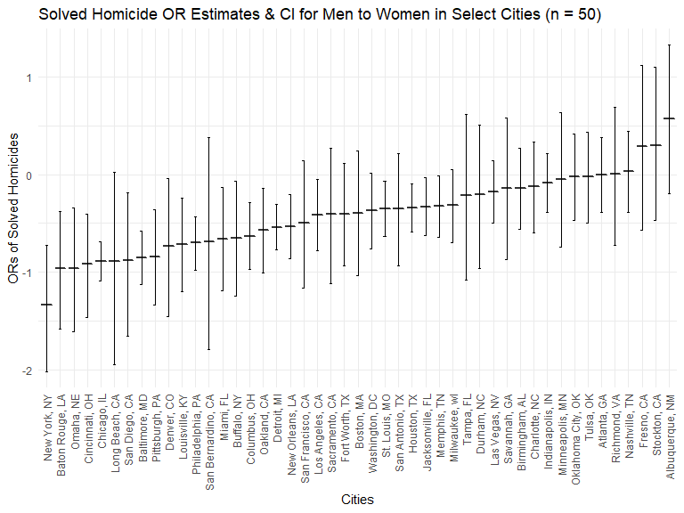
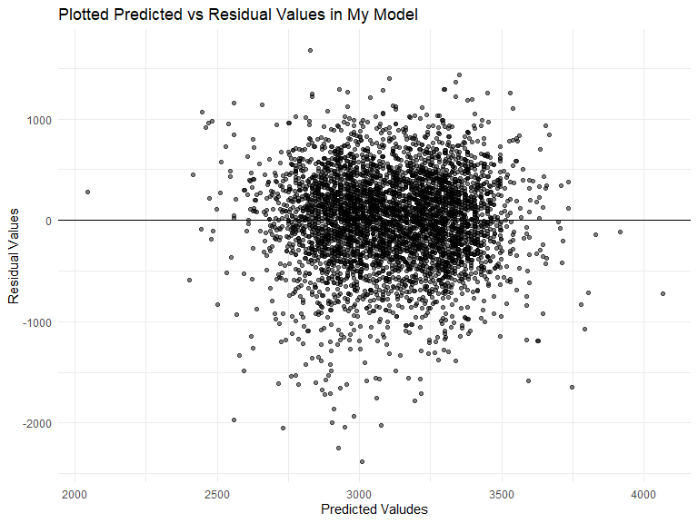
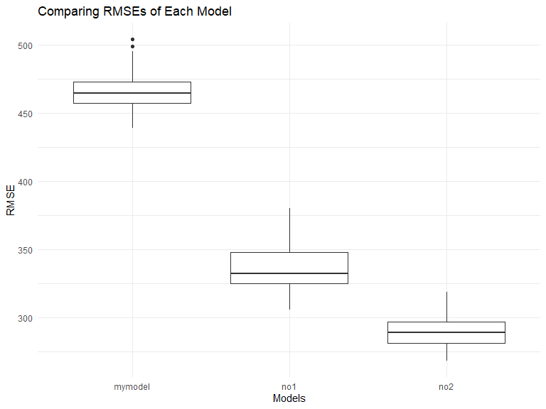

HW 6
================
Jennifer Mizhquiri

# Problem 1

# Problem 2

Steps:

1.  Cleaned the data

- created a `city_state_ variable`
- created a variable for `solved` homicides
- removed Dallas, TX; Phoenix, AZ; and Kansas City, MO – these don’t
  report victim race. Also omit Tulsa, AL
- `victim_race` was restricted to `white` or `black`
- `victim_age` is numeric

2.  Use the glm function for Baltimore

- Isolated data related to Baltimore, MD

For the city of Baltimore, MD, use the glm function to fit a logistic
regression with resolved vs unresolved as the outcome and victim age,
sex and race as predictors. Save the output of glm as an R object;apply
the broom::tidy to this object

    ## # A tibble: 4 × 7
    ##   term             estimate std.error statistic  p.value conf.low conf.high
    ##   <chr>               <dbl>     <dbl>     <dbl>    <dbl>    <dbl>     <dbl>
    ## 1 (Intercept)       0.310     0.171        1.81 7.04e- 2  -0.0245  0.648   
    ## 2 victim_age       -0.00673   0.00332     -2.02 4.30e- 2  -0.0133 -0.000246
    ## 3 victim_sexMale   -0.854     0.138       -6.18 6.26e-10  -1.13   -0.584   
    ## 4 victim_raceWhite  0.842     0.175        4.82 1.45e- 6   0.501   1.19

- recall the estimates above are log odds ratios

Obtain the estimate and confidence interval of the adjusted odds ratio
for solving homicides comparing male victims to female victims keeping
all other variables fixed.

| term             |    OR | conf.low | conf.high |
|:-----------------|------:|---------:|----------:|
| (Intercept)      | 1.363 |   -0.025 |     0.648 |
| victim_age       | 0.993 |   -0.013 |     0.000 |
| victim_sexMale   | 0.426 |   -1.126 |    -0.584 |
| victim_raceWhite | 2.320 |    0.501 |     1.187 |

In Baltimore, MD, men who are the victims of homicides are 0.426 as
likely to have a solved homicide compared to women, adjusting for victim
race (white vs. black) and victim age.We are 95% confident that the true
value lies between -1.1264 to -0.5842.

3.  Now run glm for each of the cities in your dataset, and extract the
    adjusted odds ratio (and CI) for solving homicides comparing male
    victims to female victims. Do this within a “tidy” pipeline, making
    use of purrr::map, list columns, and unnest as necessary to create a
    dataframe with estimated ORs and CIs for each city.

<!-- -->

    ## # A tibble: 6 × 10
    ##   city_state    df       models term  estimate std.e…¹ statis…²  p.value conf.…³
    ##   <fct>         <list>   <list> <chr>    <dbl>   <dbl>    <dbl>    <dbl>   <dbl>
    ## 1 Albuquerque,… <tibble> <glm>  vict…  5.70e-1   0.385  1.48e+0 1.39e- 1  -0.193
    ## 2 Atlanta, GA   <tibble> <glm>  vict…  7.71e-5   0.194  3.97e-4 1.00e+ 0  -0.385
    ## 3 Baltimore, MD <tibble> <glm>  vict… -8.54e-1   0.138 -6.18e+0 6.26e-10  -1.13 
    ## 4 Baton Rouge,… <tibble> <glm>  vict… -9.64e-1   0.306 -3.15e+0 1.65e- 3  -1.59 
    ## 5 Birmingham, … <tibble> <glm>  vict… -1.39e-1   0.212 -6.57e-1 5.11e- 1  -0.560
    ## 6 Boston, MA    <tibble> <glm>  vict… -3.95e-1   0.326 -1.21e+0 2.26e- 1  -1.04 
    ## # … with 1 more variable: conf.high <dbl>, and abbreviated variable names
    ## #   ¹​std.error, ²​statistic, ³​conf.low

Create a plot that shows the estimated ORs and CIs for each city.
Organize cities according to estimated OR, and comment on the plot.

The odds ratios of solved homicides demonstrate a wide range in odds of
having a solved homicide versus an unsolved/open homicide case for men
compared to women across several cities, when adjusting for victim race
(black vs white) and victim age. Interestingly, in most cities, the odds
of having a solved homicide versus an unsolved/open homicide for a male
victim is lower than the odds of having a solved homicide versus an
unsolved/open homicide for a female victim (when adjusting for victim
age/race). There is a wide range of confidence intervals, however, so
that might warrant more inspection and other factors might be more
closely evaluated.

# Problem 3

Steps:

1.  Cleaned the data

- ensured all categorical variables were factors in the data
- removed missing data

2.  I propose the following model:

Y = B(babysex) + B(smoken) + B(wtgain) + B(smoken) + B(mrace2) +
B(mrace3) + B(mrace4) + B(wtgain) + Error

| term        |   estimate |  std.error |  statistic |  p.value |
|:------------|-----------:|-----------:|-----------:|---------:|
| (Intercept) | 3118.61507 | 19.7580315 | 157.840373 | 0.00e+00 |
| babysex2    |  -76.68418 | 14.1138513 |  -5.433257 | 1.00e-07 |
| smoken      |  -11.68251 |  0.9841585 | -11.870559 | 0.00e+00 |
| mrace2      | -355.84004 | 15.0753057 | -23.604167 | 0.00e+00 |
| mrace3      | -184.86724 | 71.6707957 |  -2.579394 | 9.93e-03 |
| mrace4      | -224.59470 | 31.5954247 |  -7.108456 | 0.00e+00 |
| wtgain      |   11.42872 |  0.6442852 |  17.738607 | 0.00e+00 |

Above: My Model

| term        |    estimate | std.error | statistic | p.value |
|:------------|------------:|----------:|----------:|--------:|
| (Intercept) | -4347.66707 | 97.958360 | -44.38281 |       0 |
| blength     |   128.55569 |  1.989891 |  64.60439 |       0 |
| gaweeks     |    27.04673 |  1.717930 |  15.74379 |       0 |

Above: Model No1: length at birth and gestational age as predictors
(main effects only)

| term             |     estimate |   std.error | statistic |   p.value |
|:-----------------|-------------:|------------:|----------:|----------:|
| (Intercept)      | -3768.304744 | 859.9204651 | -4.382155 | 0.0000120 |
| bhead            |    79.505534 |  25.9479616 |  3.064038 | 0.0021971 |
| blength          |    31.510998 |  17.8264311 |  1.767656 | 0.0771888 |
| babysex2         |   259.978460 | 197.9104553 |  1.313617 | 0.1890448 |
| bhead:blength    |     1.560806 |   0.5269054 |  2.962213 | 0.0030710 |
| bhead:babysex2   |   -12.662006 |   7.0449983 | -1.797304 | 0.0723569 |
| blength:babysex2 |     4.210673 |   4.1691123 |  1.009969 | 0.3125666 |

Above: Model No2: head circumference, length, sex, and all interactions
(including the three-way interaction) between these

*Modeling process*

- I selected factors that I recognized from the literature may correlate
  to birth weight, such as maternal smoking status, maternal race, and
  the mother’s weight gain during pregnancy. I also added baby sex.

*Plot residuals vs predictors in my model*

- the plotted residuals and predictors indicate there is some clustering
  going on. I am content to proceed with my model for the purposes of
  the homework, however, I may have wanted to inspect my model some more
  using e.g. correlation matrices and inspected the variables for more
  theorized collinearity.

*Comparing the three models*

As a result, I can see visually that model \#2 is the better model on
average as it has a lower RMSE. My model has a relatively much higher
RMSE. This is not surprising given the above noted issues with my model
selection.
