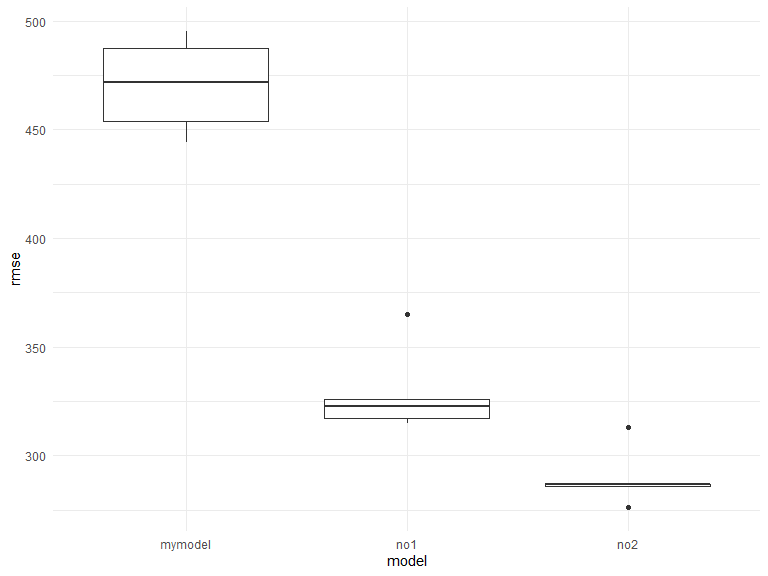
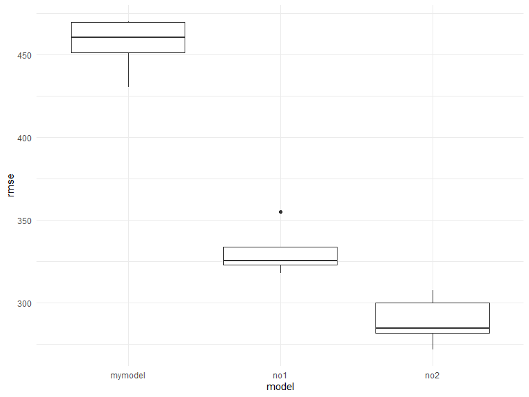

HW 6
================

# Problem 2

*Description of raw data* This dataset overviews demographic and
geographic data for homicide victims across various cities in the United
States. It has `n rows(homicide_rawdf)` rows and `ncols(homicide_rawdf)`
columns.

Steps:

1.  Cleaned the data

2.  Use the glm function for Baltimore

``` r
baltimore_df = 
  homicide_cleandf %>% 
  filter(
    city_state == "Baltimore, MD"
  )
```

For the city of Baltimore, MD, use the glm function to fit a logistic
regression with resolved vs unresolved as the outcome and victim age,
sex and race as predictors. Save the output of glm as an R object;apply
the broom::tidy to this object

``` r
fit_logistic = 
  baltimore_df %>% 
  glm(solved ~ victim_age + victim_sex + victim_race, data = ., family = binomial()) %>% 
  broom::tidy()
```

- recall the estimates above are log odds ratios \*

Obtain the estimate and confidence interval of the adjusted odds ratio
for solving homicides comparing male victims to female victims keeping
all other variables fixed.

``` r
fit_logistic %>% 
  mutate(OR = exp(estimate)) %>% 
  select(term, log_OR = estimate, OR, p.value) %>% 
  filter(
    term == "victim_sexMale"
  ) %>% 
  knitr::kable(digits = 3)
```

| term           | log_OR |    OR | p.value |
|:---------------|-------:|------:|--------:|
| victim_sexMale | -0.854 | 0.426 |       0 |

``` r
fit_logistic
```

    ## # A tibble: 4 × 5
    ##   term             estimate std.error statistic  p.value
    ##   <chr>               <dbl>     <dbl>     <dbl>    <dbl>
    ## 1 (Intercept)       0.310     0.171        1.81 7.04e- 2
    ## 2 victim_age       -0.00673   0.00332     -2.02 4.30e- 2
    ## 3 victim_sexMale   -0.854     0.138       -6.18 6.26e-10
    ## 4 victim_raceWhite  0.842     0.175        4.82 1.45e- 6

Men who are the victims of homicides are 0.426 as likely to have a
solved homicide compared to women, adjusting for victim race (white
vs. black) and victim age.

# Problem 3

prediction vs residuals (diff between actual and predicted); there
should be no linearity because it would be a violation of the assumption

you use the model to get the predicted model to get the residual show
rmse

Steps:

1.  Cleaned the data

``` r
birth_cleandf = 
  birth_rawdf %>% 
  mutate(
    babysex = as.factor(babysex),
    frace = as.factor(frace),
    malform = as.factor(frace),
    mrace = as.factor(mrace)
  ) %>% 
  drop_na()
```

residual plots have a line going through 0

geom_point (hline)

2.  I propose the following model:

y = b(babysex) + b(smoken) + b(wtgain) + b(smoken) + b(mrace) +
b(malform) + b(wtgain) + error

``` r
fit_mymodel = lm(bwt ~ babysex + smoken + mrace + wtgain, data = birth_cleandf)

fit_no1 = lm(bwt ~ blength + gaweeks, data = birth_cleandf)

fit_no2 = lm(bwt ~ bhead + blength + babysex + bhead*blength + bhead*babysex + blength*babysex, data = birth_cleandf)
```

``` r
fit_no1 = lm(bwt ~ blength + gaweeks, data = birth_cleandf)

fit_no2 = lm(bwt ~ bhead + blength + babysex + bhead*blength + bhead*babysex + blength*babysex, data = birth_cleandf)
```

*Modeling process*

- I selected factors that I recognized from the literature may correlate
  to birth weight, such as maternal smoking status, maternal race, and
  the mother’s weight gain during prenancy. I also added baby sex.

*Plot residuals vs predictors in my model*

- the plotted residuals and predictors indicate no colinearity between
  my models. As such, I am content to proceed with my model.

``` r
birth_cleandf %>%
  add_predictions(fit_mymodel) %>% 
  add_residuals(fit_mymodel) %>% 
  ggplot(aes(x = pred, y = resid)) + geom_point(alpha = 0.5) + geom_hline(yintercept = 0)
```



*Identify RMSE*

fit_mymodel = lm(bwt \~ babysex + smoken + mrace + wtgain, data =
birth_cleandf)

fit_no1 = lm(bwt \~ blength + gaweeks, data = birth_cleandf)

fit_no2 = lm(bwt \~ bhead + blength + babysex + bhead*blength +
bhead*babysex + blength\*babysex, data = birth_cleandf)

``` r
model_df = 
  crossv_mc(birth_cleandf, 5) %>% 
  mutate(
    train = map(train, as_tibble),
    test = map(test, as_tibble),
  )


model_df = 
  model_df %>% 
  mutate(
    fit_mymodel = map(.x = train, ~lm(bwt ~ babysex + smoken + mrace + wtgain, data = .x)),
    fit_no1 =    map(.x = train, ~lm(bwt ~ blength + gaweeks, data = .x)),
    fit_no2 = map(.x = train, ~lm(bwt ~ bhead + blength + babysex + bhead*blength + bhead*babysex + blength*babysex, data = .x))
  ) %>% 
  mutate(
    rmse_mymodel = map2_dbl(.x = fit_mymodel, .y = test, ~rmse(model = .x, data = .y)),
    rmse_no1 =    map2_dbl(.x = fit_no1, .y = test, ~rmse(model = .x, data = .y)),
    rmse_no2 = map2_dbl(.x = fit_no2, .y = test, ~rmse(model = .x, data = .y))
  )
```

``` r
model_df %>% 
  select(starts_with("rmse")) %>% 
  pivot_longer(
    everything(),
    names_to = "model",
    values_to = "rmse",
    names_prefix = "rmse_"
  ) %>% 
  ggplot(aes(x = model, y = rmse)) +
  geom_boxplot()
```



As a result, I can see visually that model \#2 is the better model on
average as it has a lower RMSE. My model has a relatively much higher
RMSE.
